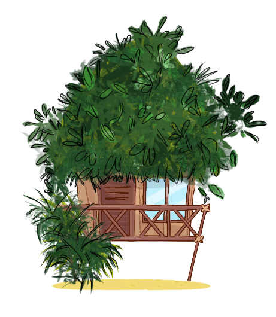
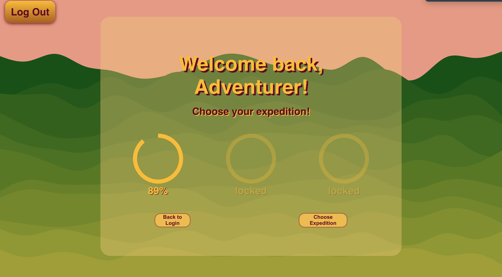
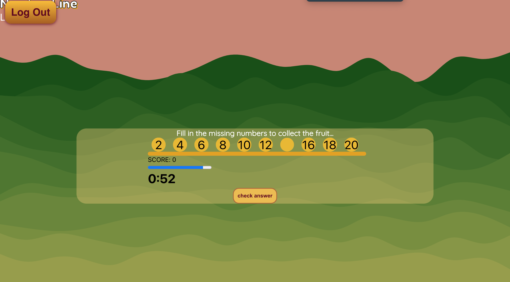

  
   
 

🌿 ABOUT THE PROJECT 🌿
 

"Lorem ipsum dolor sit amet, consectetur adipiscing elit, sed do eiusmod tempor incididunt ut labore et dolore magna aliqua. Ut enim ad minim veniam, quis nostrud exercitation ullamco laboris nisi ut aliquip ex ea commodo consequat. Duis aute irure dolor in reprehenderit in voluptate velit esse cillum dolore eu fugiat nulla pariatur. Excepteur sint occaecat cupidatat non proident, sunt in culpa qui officia deserunt mollit anim id est laborum."

🌿 SCREENSHOTS 🌿
 

🌿 TECH STACK 🌿

 

          
           

 

  

🌿 FEATURES 🌿     Social integration   Security   Analytics dashboard   Interactive gameplay   Progress tracker

 

🌿 ENVIRONMENT VARIABLES 🌿
   
The environment variables are not available due to security resons.

 

🌿 PREREQISITIES 🌿
 
 
Auth0
 
Chakra
 
MUI
 
 Jest 

 

🌿 INSTALLATION 🌿 

🌿 RUN LOCALLY 🌿 

npm start runs the app in the development mode. Open http://localhost:3000 to view it in the browser.

🌿 DEPLOYMENT 🌿 

🌿 ROADMAP 🌿

🌿 OUR TEAM🌿

<a href = https://www.linkedin.com/in/bhupinder-singh-248284243 style = color:lightgreen> Bhupinder Singh</a>  
<a href= https://www.linkedin.com/in/chuks-igwe-b539ba175 style = color:lightgreen> Chucks Igwe</a> 
<a href = https://www.linkedin.com/in/luca-osztian-b206a0243 style = color:lightgreen> Luca Osztian</a> 
<a href= https://www.linkedin.com/in/mari-lovell style = color:lightgreen> Mari Lovell</a> 
<a href= https://www.linkedin.com/in/nasra-saleh-185537222 style = color:lightgreen> Nasra Saleh</a> 
<a href = https://www.linkedin.com/in/noah-aldhous-4436a3195 style = color:lightgreen> Noah Aldhous</a>

